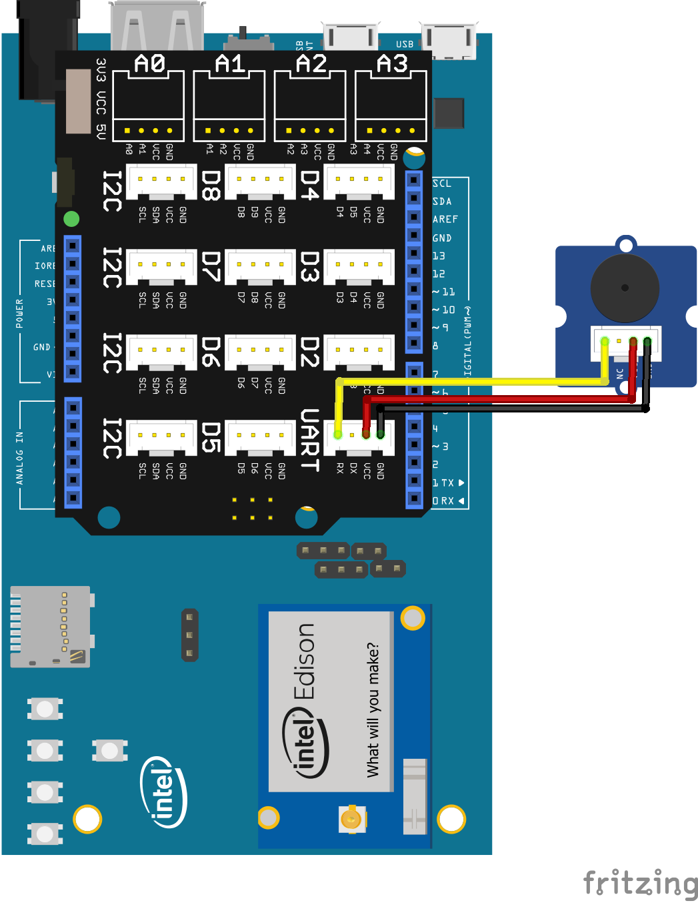

Grove Buzzer sample for Android Things using UPM
------------------------------------------------

This example demonstrates a PWM Buzzer connection using UPM.

build.gradle:

   ````
   dependencies {
       compile 'io.mraa.at.upm:upm_grove:1.+'
       compile 'io.mraa.at:mraa:1.+'
       provided 'com.google.android.things:androidthings:0.4-devpreview'
   }
   ````
Java:
````
sound = new upm_buzzer.Buzzer(pwmIndex);
// play each note for one half second
int note = sound.playSound(upm_buzzer.javaupm_buzzer.BUZZER_DO, 500000);
sound.stopSound();
````


Pre-Requisites:
---------------
Use of the Grove Kit (for Joule or Edison) makes this easy. See the following links for getting
a starter kit.

*  https://www.seeedstudio.com/Grove-Maker-Kit-for-Intel-Joule-p-2796.html
*  https://www.seeedstudio.com/Grove-Starter-Kit-V3-p-1855.html


You will need:

1. Android Things compatible board.
2. Grove header or Breakout board.
3. A Grove Buzzer.


Build and install:
------------------

On Android Studio, select the "grovebuzzer" module in select box by the "Run" button
and then click on the "Run" button.





Changing the PWM pin
--------------------
This example uses a pwm (digital output) to buzz an buzzer. The PWM could be connected
via the shield to a Grove buzzer... or it could be a buzzer on a brakeout board wired directly to
a PWM line, power  and ground.

The PWM line to be used is specified in the strings.xml file (src/res/values directory).

````
<resources>
    <string name="Buzzer_Edison_Arduino">PWM0</string>
    <string name="Buzzer_Edison_Sparkfun">PWM0</string>
    <string name="Buzzer_Joule_Tuchuck">PWM_0</string>
</resources>
````

The code will automatically determine the board type being run on (modify BoardDefaults.java) and select a string from this file for the GPIO line.
See the top level README.md for a table describing the available GPIO pins and where to find them
on the board.
