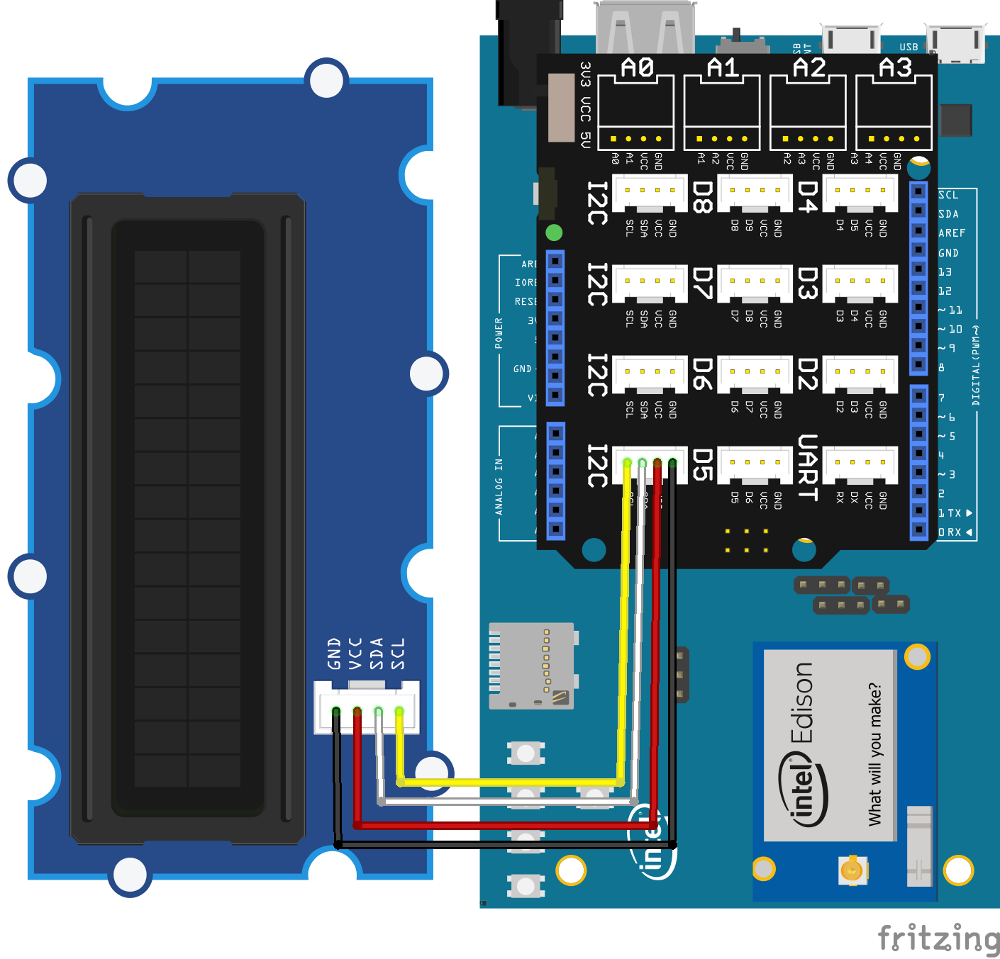

Grove jhd1313m1 I2C connected LCD display sample for Android Things using UPM
-----------------------------------------------------------------------------

This example demonstrates connecting an I2C display to Android Things using UPM.
Commands to display text and colors are sent to an LCD display.

Gradle:

   ````
   dependencies {
       compile 'io.mraa.at.upm:upm_jhd1313m1:1.3.0'
       compile 'io.mraa.at:mraa:1.+'
       provided 'com.google.android.things:androidthings:0.4-devpreview'
   }
   ````

Java:
````
lcd = new upm_jhd1313m1.Jhd1313m1(i2cIndex);
lcd.clear();
lcd.write("Hello World");
lcd.delete();
````


Pre-Requisites:
---------------
Use of the Grove Kit (for Joule or Edison) makes this easy. See the following links for getting
a starter kit.

*  https://www.seeedstudio.com/Grove-Maker-Kit-for-Intel-Joule-p-2796.html
*  https://www.seeedstudio.com/Grove-Starter-Kit-V3-p-1855.html


You will need:

1. Android Things compatible board.
2. Grove header or Breakout board.
3. A JHD1313m1 LCD display (it's in the grove kit).


Build and install:
------------------

On Android Studio, select the "jhd1313m1" module in select box by the "Run" button
and then click on the "Run" button.




Changing the I2C bus
--------------------


The I2C bus to be used is specified in the strings.xml file (src/res/values directory).

````
<resources>
    <string name="app_name">Jhd1313m1lcd</string>

    <string name="Lcd_Edison_Arduino">I2C6</string>
    <string name="Lcd_Edison_Sparkfun">I2C1</string>
    <string name="Lcd_Joule_Tuchuck">I2C0</string>
</resources>
````

The code will automatically determine the board type being run on (modify BoarDefaults.java) and select a string from this file for the I2C bus.
The above example uses I2C6 on the Edison Arduino shield and I2C0 on the Joule Tuchuck
development board. These strings are programmed into the Peripheral Manager and read from their
into the UPM library to determine the bus to be used.

See the top level README.md for a table describing the available I2C busses and where to find them
on the board.
